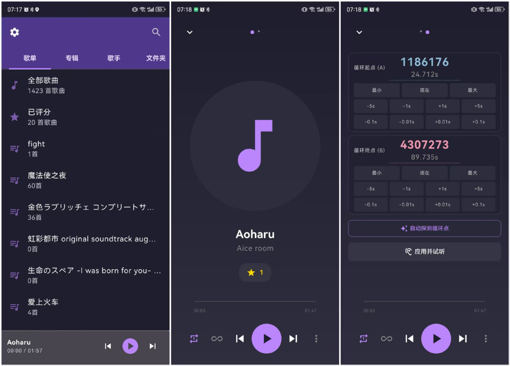
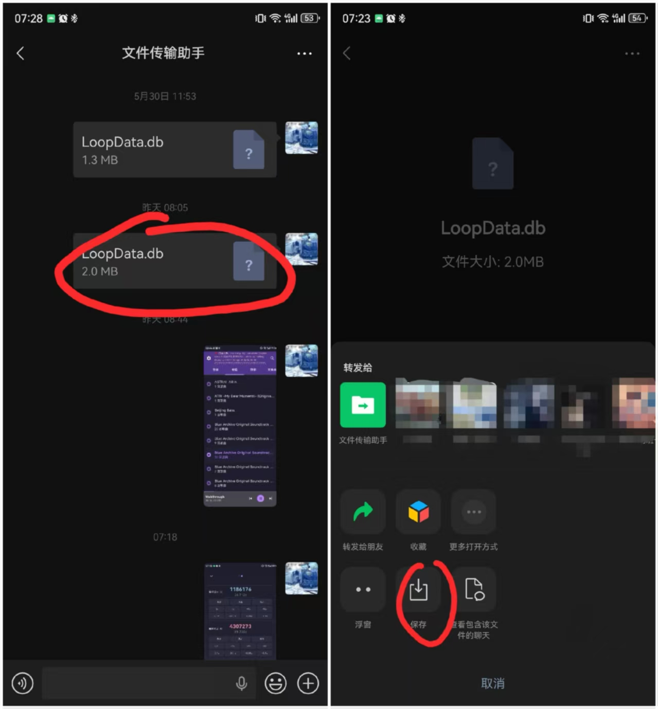
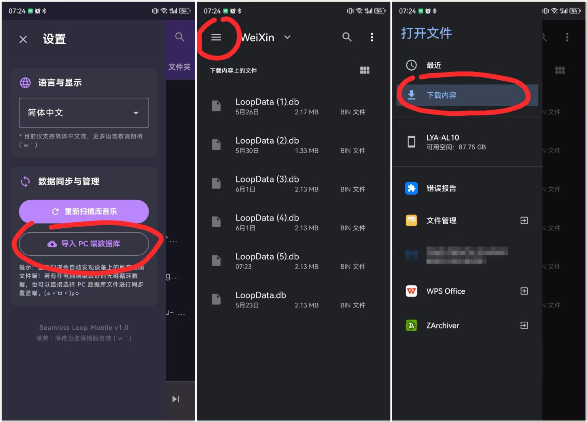
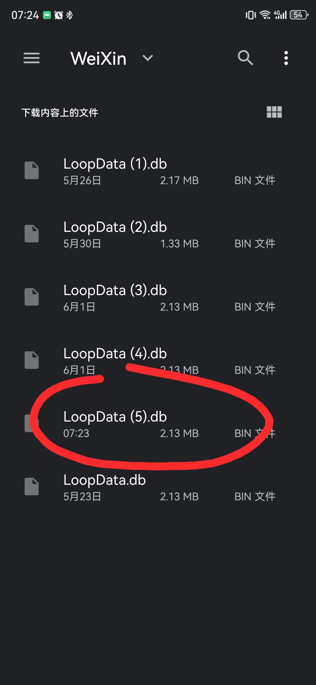

# SeamlessLoopMobile 🔄

Android 端高性能**无缝循环音频播放器**，采用 Kotlin + C++ (Oboe) 混合架构，专门为实现游戏音乐及各种循环音频的完美无缝衔接而设计。

现在支持 PC 端数据库导入与手机端数据导出为 PC 端可识别数据库；手机上的循环点、评分、歌单等修改可以通过“导出 PC 端数据库”传回电脑端使用。

当前界面参考了 NeriPlayer 的本地播放器体验，并结合本项目的无缝循环定位重新实现：底部主导航、毛玻璃迷你播放器、封面展示、独立搜索/设置/播放统计页面，以及统一的弹出式页面切换动画。

同时新增 GitHub 同步：可通过 GitHub Contents API 在单个 JSON 快照中同步歌单、循环点和评分；自动同步默认关闭，用户开启后会在网络可用时由后台周期任务同步。



---

## 📱 核心功能与亮点

- **高性能 Native 播放引擎**：基于 Google Oboe 1.9.3 + NDK minimp3 解码器，实现亚毫秒级别的低延迟无缝循环播放。
- **自动循环点探测引擎 (`loopfinder`)**：集成基于 FFT & Chroma 提取的高级音频算法，支持一键分析音频的最佳循环衔接点（提供 Top 5 候选推荐）。
- **A/B 式音乐支持**：独创支持由 Intro 段（A轨）和 Loop 段（B轨）组成的双轨歌曲无缝拼接播放，自动标记 B 轨并于 UI 中优雅过滤。
- **Room 3NF 数据持久化**：精心设计的 Room 2.7.0-alpha11 规范 3NF 数据库，支持双指纹去重（优先匹配 `FileName+Duration`，兜底 `FilePath` 匹配）。
- **现代播放器界面**：Compose + Material3 构建媒体库、搜索、设置、播放统计和全屏播放页；底部 `MiniPlayer` 支持 Haze 毛玻璃、封面、进度与常用播放控制。
- **真实收听时长统计**：只统计处于播放状态的墙钟收听时间，按累计时长排行；不统计播放次数和循环次数，文件缺失时仍保留历史记录。
- **GitHub 同步**：将歌单、循环点和评分同步到 GitHub 仓库中的单个 JSON 文件；支持手动同步、云端/本机摘要预览、用本机数据覆盖云端、删除云端快照，以及默认关闭的 WorkManager 自动同步。
- **封面与音频格式展示**：扫描时写入封面 URI、MIME、采样率和码率，在列表、迷你播放器和播放页中统一展示。
- **主题与触感反馈**：支持跟随系统/浅色/深色主题偏好，并可在设置中开关按钮触感反馈。

---

## 🚀 用户使用指南

### 🎧 媒体库、搜索、设置与统计

- 底部导航提供 **媒体库 / 搜索 / 设置** 三个主入口。
- 媒体库右上角的统计入口可打开播放统计页，查看累计收听时长、Top 5 条形图和歌曲排行。
- 设置页中的数据区域可清除播放统计；清除前会弹出确认对话框。
- 搜索页不会自动弹出键盘，进入后可以直接浏览或手动输入关键词。

### 💻 导入 / 导出 PC 数据库
> [!TIP]
> **点击底部“设置”，进入“数据同步与管理”。**
> - **导入 PC 端数据库**：选择电脑端 `.db` 文件，APP 会自动进行容差匹配和增量批量写入，补充手机端没有的循环点、候选循环点、评分、歌单等数据。
> - **导出 PC 端数据库**：将手机端当前的歌曲元数据、循环点、候选循环点、评分、歌单与队列转换为 PC 端 3NF schema，可传回电脑端继续使用。

下面以微信传输助手为例讲解同步方法：

1.首先**下载**电脑端传输的db文件



2.在播放器的设置界面寻找到db文件，如果一开始没有找到db文件，可以在文件夹的“下载”位置找到



3.找到所需的db文件，按下即同步



导出时在同一设置区域点击 **“导出 PC 端数据库”**，选择保存位置即可。导出的文件名默认为：

```text
seamless_loop_pc_export_yyyyMMdd_HHmmss.db
```

### ☁️ GitHub 同步

> [!TIP]
> **点击底部“设置”，进入“GitHub 同步”。**
> - 填写 GitHub Token、Owner、Repository、Branch 和同步文件 Path 后保存配置。
> - 点击 **立即同步** 可手动同步歌单、循环点和评分。
> - 开启 **自动同步** 后，APP 会在网络可用时约每小时后台同步一次；默认关闭。

GitHub 同步使用仓库内的单个 JSON 快照文件（默认 `seamless-loop/sync.json`），不会上传音频文件本体，也不会同步播放统计、播放队列、封面/格式展示字段或 App 设置。循环点 `0/0` 和评分 `0` 会被视为“未设置”，不会覆盖已有的实质数据。


---

## 🛠️ 开发者快速上手

### 💻 运行环境
- **操作系统**：原生 Windows 11 (命令行推荐使用 PowerShell)。
- **编译依赖**：Min SDK 26, Target SDK 35, Gradle 9.1.0, Kotlin 2.1.0, Room KSP 启用，Compose compiler 插件启用。
- **主要 UI 依赖**：Jetpack Compose Material3、Haze 0.7.0、Coil 2.7.0。

### ⌨️ 常用开发命令
- **编译 Debug 包**：
  ```powershell
  .\gradlew.bat assembleDebug
  ```
- **运行单元测试**：
  ```powershell
  .\gradlew.bat testDebugUnitTest
  ```
- **运行特定测试（例如播放模式测试）**：
  ```powershell
  .\gradlew.bat testDebugUnitTest --tests "com.cpu.seamlessloopmobile.viewmodel.PlayModeTest"
  ```
- **一键调试部署 (需 Root 设备)**：
  运行根目录下的部署脚本：
  ```powershell
  .\run.bat
  ```

---

## 📖 深入架构与避坑说明
如果您是参与本项目的**智能体(AI)** 或 **人类开发者**，在进行任何实质性代码修改前，请**务必先阅读 [AGENTS.md](./AGENTS.md) 了解以下关键细节**：
1. **构建天坑**：`app/build.gradle.kts` 中 `kotlin-android` 插件保持注释；Compose compiler 插件不要删除。
2. **JNI / fopen 路径限制**：Native 音频分析无法直接读取 `content://`，必须先拷贝到私有 cache 目录。
3. **UI / Haze 层级**：页面内容是唯一 Haze source；底部 `MiniPlayer` 是上层 `hazeChild` sibling，不能放进 source 内。
4. **播放统计语义**：只按真实收听时长排序，不统计播放次数或循环次数。
5. **Room Schema**：Room 9 张实体表和 3 个 DAO 的详细映射图。
6. **包结构速查**：子模块（audio, data, db, viewmodel, model, scanner, jni 等）职责定义。

本轮 UI 与统计改造参考了 NeriPlayer 的视觉与交互方向，记录见 [docs/2026-07-06_NeriPlayer风格UI与播放统计.md](./docs/2026-07-06_NeriPlayer风格UI与播放统计.md)。GitHub 同步与自动同步记录见 [docs/2026-07-07_GitHub同步与自动同步.md](./docs/2026-07-07_GitHub同步与自动同步.md)。
