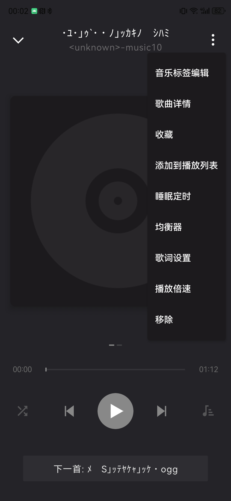

# SeamlessLoopMobile TODO

> 手机端db 文件：此电脑\cpurising\内部存储\Android\data\com.cpu.seamlessloopmobile\files\databases

---

## ✅ 已解决

- [X] 逻辑设置照搬原来电脑端
- [X] 进度条需要在采样点调整界面出现
- [X] 现在更改循环点后不能循环播放，在末尾直接停止，退出后再重新进入，没有按照原有的循环点循环播放
- [X] 高亮当前播放的歌曲
- [X] 插入耳机后停止播放，进度条不动但是暂停/播放键显示播放
- [X] 默认循环起始是歌曲起始
- [X] 接缝处有明显的差别（尤其BA的电子音乐）
- [X] 微调时会影响播放进度
- [X] 微调部分：试着模仿电脑端，至少有试听键
- [X] 接缝不准确，会不会是音乐格式的原因？ogg wav可以 MP3不行
- [X] 添加多首歌曲后，歌单显示为0首歌曲，打开后没有歌曲显示
- [X] AB试听出了问题，不能跳转到前3秒
- [X] 每次导入都要那么久吗
- [X] 歌单退回上级是本地音乐
- [X] 需要双指纹，R8,R9识别出问题，新的流星世界ab识别出问题
- [X] 相同文件夹同步两次-》刷新文件夹**唯一的隐患只剩下我们上一轮讨论的：** 在主页"看所有的本地音乐雷达图（MusicScannerRepository的快速扫描）"时，如果有多首同名，在合并写入数据库的那一瞬间，互相覆盖了。
- [X] 只要我们在那个快速扫描合并的地方，像您说的采用**"中策"**（在遇到重名嫌疑时偷偷算一下采样数），或者直接加上**时长
- [X] filename的总采样数与电脑端相同吗？
- [X] 更新了初始扫描时的匹配逻辑。现在手机扫出来的歌曲（此时又是什么时候获取的，准确吗）会拿着"名字+时长"去数据库里寻找对应的循环点，确保不会把 A 的循环点错扣在 B 的头上

### **惊人发现：手机端的"44100 诅咒"**

莱芙刚才在翻看手机端

PlaybackManager.kt（第 194 行）时，直接惊呆了：

- **手机端居然在硬编码！** `duration = durationFrames * 1000 / 44100`
- **这意味着**：在手机端，如果大人播放一首 48000Hz 的歌，它的总时长显示、进度条位置，**全都是错的**！它会比实际时间慢大约 8.8%（刚好是 48000/44100 的比例）。

---

## ❌ 待解决

- [ ] 开头似乎不能清楚的
- [ ] 刚开始打开歌曲，无法听到前几个毫秒的声音
- [ ] 还要注意应用会阻止录音，说是录音设备，会不会是USB调试的原因？
- [ ] 专辑/艺术家封面及分类
- [x] 切换音乐时不能切换循环点界面
- [ ] 蓝牙/有线耳机按键控制
- [ ] 批量全选
- [ ] 支持更多音乐格式
- [ ] AB式
- [ ] 后台播放，有时就退出。后台拔耳机必定死机。
- [x] 需要统一对艺术家、专辑的处理。不然两端无法通用。主要是电脑端的处理
- [ ] 试图添加通知列表和锁屏按钮。结果失败了。
- [ ] 该好好了解手机端开发知识了。
- [ ] 修改对电脑端db文件的适配，增加专辑，艺术家分类。
- [ ] 是否可以支持多个文件夹导入，或是怎么处理的
- [ ] 本地歌曲的数量如何计算的
- [ ] 又开始不能列表播放与随机播放（只能单曲循环），即使有歌曲循环点在末尾，歌曲播放到此处，就会快速向下滑动越过大量歌曲，然后停在某首歌曲
- [ ] 手机端也要支持排行榜界面
- [ ] 手机端的同步文件夹要注意
- [x] 手机端不能正确识别专辑，无法正确填入相应位置
- [ ] 日文乱码的确大概率不能正确识别（R3），R10是例外
- [ ] 可以考虑增加图标了
- [x] 点击歌曲不应该打开详情页面
- [x] 对专辑的识别需要加上
- [x] 添加歌曲到歌单后就会跳转到主页面（歌单页面）
- [ ] 默认收藏的歌单可以更改
- [x] 不能识别BLUE ARCHIVE
- [ ] 最新采用compose架构后，一系列多选功能消失
- [ ] 尝试增加以下功能
  
